# Cloudflare Workers D1 自动配置指南

## 概述

D1 数据库现在支持**自动初始化**！不需要手动运行 SQL 脚本，Worker 会在首次启动时自动创建所有表结构。

---

## 快速配置步骤

### 步骤 1: 创建 D1 数据库

```bash
npx wrangler d1 create v0tv-db
```

执行后会返回数据库 ID，类似：

```
✅ Successfully created DB 'v0tv-db'
database_id = "xxxxxxxx-xxxx-xxxx-xxxx-xxxxxxxxxxxx"
```

**复制这个 `database_id`！**

---

### 步骤 2: 配置 wrangler.jsonc

编辑 `wrangler.jsonc`，取消注释 D1 配置并填入数据库 ID：

```jsonc
{
  // ... 其他配置 ...

  "d1_databases": [
    {
      "binding": "DB",
      "database_name": "v0tv-db",
      "database_id": "粘贴你的database_id"
    }
  ]
}
```

---

### 步骤 3: 配置环境变量

在 **Cloudflare Dashboard** 中配置：

**路径**: Workers & Pages → v0tv → Settings → Variables

**必需变量**:
```bash
PASSWORD=your_password
NEXT_PUBLIC_STORAGE_TYPE=d1
USERNAME=admin
```

**可选变量**:
```bash
NEXT_PUBLIC_ENABLE_REGISTER=true
SITE_NAME=V0TV
ANNOUNCEMENT=欢迎使用V0TV
```

---

### 步骤 4: 部署

```bash
pnpm run pages:build
npx wrangler deploy
```

---

## 自动初始化功能说明

### 📦 自动创建的表

Worker 首次运行时会自动创建以下表：

| 表名 | 用途 |
|------|------|
| `users` | 用户账号 |
| `play_records` | 播放记录 |
| `favorites` | 收藏 |
| `search_history` | 搜索历史 |
| `skip_configs` | 片头片尾跳过配置 |
| `user_settings` | 用户设置 |
| `admin_configs` | 管理员配置 |

### 🔄 幂等性保证

- 使用 `CREATE TABLE IF NOT EXISTS`
- 多次运行不会出错
- 不会覆盖已有数据

### 🚀 性能优化

- 初始化仅执行一次（全局单例）
- 并发请求共享初始化过程
- 自动创建索引提升查询性能

---

## 验证配置

部署后访问你的 Worker URL，检查日志：

```
[D1] 开始自动初始化数据库...
[D1] 数据库初始化完成
```

如果看到这些日志，说明配置成功！

---

## 常见问题

### Q: 需要手动运行 SQL 脚本吗？

**A**: 不需要！`scripts/d1-init.sql` 仅供参考，Worker 会自动执行初始化。

### Q: 如何查看数据库中的表？

**A**: 使用 Wrangler CLI：

```bash
# 查看表列表
npx wrangler d1 execute v0tv-db --command "SELECT name FROM sqlite_master WHERE type='table';"

# 查看特定表结构
npx wrangler d1 execute v0tv-db --command "PRAGMA table_info(users);"
```

### Q: 如何迁移已有数据？

**A**: 如果你有 localStorage 的数据，切换到 D1 后需要手动迁移。建议：

1. 先在 Dashboard 设置 `NEXT_PUBLIC_STORAGE_TYPE=localstorage`
2. 导出数据（在浏览器 Console 执行）：
   ```javascript
   console.log(JSON.stringify(localStorage));
   ```
3. 改为 `NEXT_PUBLIC_STORAGE_TYPE=d1` 并重新部署
4. 重新添加数据

### Q: 初始化失败怎么办？

**A**: 检查以下内容：

1. **确认 binding 名称为 `DB`**（必须大写，代码中硬编码）
2. **确认数据库 ID 正确**
3. **查看 Worker 日志**：Dashboard → Workers & Pages → v0tv → Logs
4. **手动测试数据库**：
   ```bash
   npx wrangler d1 execute v0tv-db --command "SELECT 1;"
   ```

### Q: 如何重置数据库？

**A**: 删除并重建：

```bash
# 删除数据库
npx wrangler d1 delete v0tv-db

# 创建新数据库
npx wrangler d1 create v0tv-db

# 更新 wrangler.jsonc 中的 database_id
# 重新部署
pnpm run pages:build && npx wrangler deploy
```

---

## 对比：手动 vs 自动初始化

| 方式 | 优点 | 缺点 |
|------|------|------|
| **手动初始化** | 完全可控 | 需要额外步骤，容易遗忘 |
| **自动初始化** ✅ | 零配置，开箱即用 | 无法自定义初始化时机 |

**推荐使用自动初始化！**

---

## 技术细节

### 初始化流程

```mermaid
graph LR
    A[Worker 启动] --> B{已初始化?}
    B -->|是| C[直接使用]
    B -->|否| D[执行 CREATE TABLE IF NOT EXISTS]
    D --> E[创建索引]
    E --> F[标记已初始化]
    F --> C
```



### 代码位置

- **自动初始化逻辑**: `src/lib/d1.db.ts` → `initializeDatabase()`
- **配置文件**: `wrangler.jsonc`
- **参考 SQL**: `scripts/d1-init.sql`（仅供参考，不需要手动运行）

---

## 支持

如有问题，请查看：

- [Cloudflare D1 文档](https://developers.cloudflare.com/d1/)
- [Wrangler CLI 文档](https://developers.cloudflare.com/workers/wrangler/)
- [项目 Issues](https://github.com/your-repo/issues)
