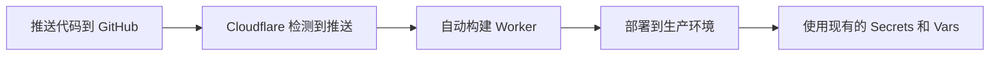

# Cloudflare Git 自动部署配置指南

如果你的 Cloudflare Workers 项目通过 **Git 集成**连接到 GitHub 仓库，当你推送代码时，Cloudflare 会自动构建和部署 Worker。

但是，**自动部署不会设置 Secrets**，你需要手动配置 PASSWORD secret。

---

## 📋 当前状态检查

### 你的项目配置

根据 `wrangler.jsonc`，你的项目需要以下环境变量：

**公开变量（已在 wrangler.jsonc 中配置）：**
- ✅ `USERNAME`: admin
- ✅ `NEXT_PUBLIC_STORAGE_TYPE`: d1
- ✅ `NEXT_PUBLIC_ENABLE_REGISTER`: true

**加密变量（需要手动设置）：**
- ❌ `PASSWORD`: 尚未设置

---

## 🔧 设置 PASSWORD Secret

### 方法 1：使用脚本（推荐）⭐

我们提供了一个专门的脚本来设置 PASSWORD secret：

```bash
# 在项目根目录运行
bash scripts/set-password-only.sh
```

这个脚本会：
1. 生成 32 位随机密码
2. 设置 PASSWORD secret
3. 保存凭据到 `.credentials.txt`
4. 验证设置是否成功

### 方法 2：通过 Cloudflare Dashboard 手动设置

1. 访问 [Cloudflare Dashboard](https://dash.cloudflare.com/)
2. **Workers & Pages** → 选择你的项目（**v0tv**）
3. **Settings** → **Variables**
4. 在 **"Secrets"** 部分（不是 Environment Variables）
5. 点击 **"Add variable"** 或 **"Edit variables"**
6. 添加：
   - **Variable name**: `PASSWORD`
   - **Value**: 你的密码（建议使用强密码）
7. 点击 **"Save"** 和 **"Deploy"**

**生成安全密码：**
```bash
openssl rand -base64 24 | tr -dc 'a-zA-Z0-9' | head -c 32
```

### 方法 3：使用 Wrangler CLI

```bash
# 1. 确保已登录
npx wrangler login

# 2. 设置 PASSWORD secret
npx wrangler secret put PASSWORD

# 3. 输入密码并回车
```

---

## 🔍 验证设置

### 检查 Secrets

```bash
# 使用验证脚本
bash scripts/verify-secret.sh

# 或手动检查
npx wrangler secret list
```

应该能看到 `PASSWORD` 在列表中。

### 在 Dashboard 中查看

1. **Workers & Pages** → 你的项目 → **Settings** → **Variables**
2. 你会看到两个部分：

   **Environment Variables（环境变量）** - 显示 3 个公开变量：
   - `USERNAME`: admin
   - `NEXT_PUBLIC_STORAGE_TYPE`: d1
   - `NEXT_PUBLIC_ENABLE_REGISTER`: true

   **Secrets（加密变量）** - 显示：
   - `PASSWORD`（只显示名称，不显示值）

### 测试登录

1. 访问你的 Worker URL（例如：`https://v0tv.你的账号.workers.dev`）
2. 使用凭据登录
3. 如果能成功登录，说明 PASSWORD secret 已正确设置

---

## 🔄 Git 自动部署流程

### 当前工作流程



**重要说明：**
- ✅ 代码更新会自动部署
- ✅ `wrangler.jsonc` 中的 Vars 会自动更新
- ❌ Secrets **不会**自动更新或创建
- 💡 PASSWORD secret **只需设置一次**，之后推送代码不会影响它

### Git 自动部署 vs 本地手动部署

| 特性 | Git 自动部署 | 本地手动部署 |
|------|-------------|-------------|
| 触发方式 | 推送到 GitHub | 运行 `npx wrangler deploy` |
| 构建环境 | Cloudflare 服务器 | 本地机器 |
| Secrets 管理 | 需要手动设置 | 脚本自动设置 |
| Environment Variables | 从 `wrangler.jsonc` 读取 | 从 `wrangler.jsonc` 读取 |
| 适用场景 | CI/CD，团队协作 | 快速迭代，本地开发 |

---

## 📝 首次设置步骤

### 对于 Git 自动部署用户

1. **设置 PASSWORD secret**（只需一次）
   ```bash
   bash scripts/set-password-only.sh
   ```

2. **等待自动部署完成**
   - 推送代码到 GitHub
   - Cloudflare 自动构建部署
   - 查看 **Workers & Pages** → 你的项目 → **Deployments**

3. **访问应用并登录**
   - 使用 `.credentials.txt` 中的凭据

4. **添加播放源**
   - 登录后进入管理面板
   - 上传或配置 `config.json`

---

## 🔐 安全建议

### Secrets 管理最佳实践

1. **使用强密码**
   ```bash
   # 生成 32 字符随机密码
   openssl rand -base64 24 | tr -dc 'a-zA-Z0-9' | head -c 32
   ```

2. **妥善保管凭据文件**
   - `.credentials.txt` 已添加到 `.gitignore`
   - 不要将密码提交到 Git
   - 建议使用密码管理器存储

3. **定期更换密码**
   ```bash
   # 重新设置密码
   npx wrangler secret put PASSWORD
   ```

4. **环境隔离**
   - 生产环境使用强密码
   - 测试环境可以使用简单密码
   - 使用 Cloudflare 的环境功能区分

---

## 🆘 常见问题

### Q: 为什么 Git 推送后 PASSWORD 没有自动设置？

**A**: Cloudflare Git 自动部署**不会设置 Secrets**，这是安全设计。Secrets 必须通过以下方式设置：
- Cloudflare Dashboard
- Wrangler CLI
- GitHub Actions（使用加密的 secrets）

### Q: 每次推送代码都需要重新设置 PASSWORD 吗？

**A**: 不需要！PASSWORD secret **只需设置一次**，之后：
- Git 推送会更新代码，但不会覆盖 Secrets
- Secrets 会持久保存在 Cloudflare 中
- 除非你主动删除或修改，否则一直有效

### Q: 如何在 Git 自动部署中使用不同的环境变量？

**A**: 修改 `wrangler.jsonc` 中的 `vars` 部分，推送到 GitHub 后会自动生效：

```jsonc
"vars": {
  "USERNAME": "admin",
  "NEXT_PUBLIC_STORAGE_TYPE": "d1",
  "NEXT_PUBLIC_ENABLE_REGISTER": "false"  // 修改这里
}
```

### Q: 我想使用 GitHub Actions 自动设置 Secrets，怎么做？

**A**: 参考 GitHub Actions 工作流配置：

```yaml
name: 部署到 Cloudflare Workers

on:
  push:
    branches: [main]

jobs:
  deploy:
    runs-on: ubuntu-latest
    steps:
      - uses: actions/checkout@v4

      - name: 设置 Secrets
        run: |
          echo "${{ secrets.WORKER_PASSWORD }}" | npx wrangler secret put PASSWORD
        env:
          CLOUDFLARE_API_TOKEN: ${{ secrets.CLOUDFLARE_API_TOKEN }}
```

需要在 GitHub 仓库设置中添加：
- `CLOUDFLARE_API_TOKEN`
- `WORKER_PASSWORD`

---

## 📚 相关文档

- [Cloudflare Workers 手动部署指南](../CLOUDFLARE_WORKERS_MANUAL_DEPLOY.md)
- [自动部署脚本说明](README.md)
- [D1 自动配置指南](../CLOUDFLARE_D1_AUTO_SETUP.md)

---

## 💡 提示

**对于 Git 自动部署用户：**
- ✅ 代码更新：推送到 GitHub 即可
- ✅ Vars 更新：修改 `wrangler.jsonc` 并推送
- ⚠️ Secrets 设置：使用脚本或 Dashboard 手动设置（只需一次）

**对于本地手动部署用户：**
- 使用 `bash scripts/auto-deploy.sh` 一键部署
- 所有配置自动完成
