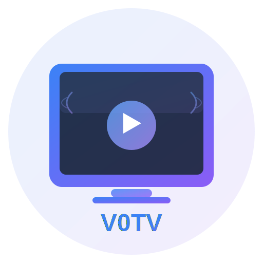

<div align="center">
  

  # V0TV

  **🎬 现代化的自托管影视聚合平台**

  <p>
    <a href="https://github.com/telagod/V0TV/releases">
      
    </a>
    <a href="https://github.com/telagod/V0TV/blob/main/LICENSE">
      
    </a>
    <a href="https://github.com/telagod/V0TV/stargazers">
      
    </a>
    <a href="https://github.com/telagod/V0TV/network/members">
      
    </a>
  </p>

  <p>
    <strong>基于 Next.js 14 · TypeScript · Tailwind CSS 构建</strong>
  </p>

  <p>
    <a href="#-特性">特性</a> •
    <a href="#-快速开始">快速开始</a> •
    <a href="#-部署指南">部署</a> •
    <a href="#-配置">配置</a> •
    <a href="#-开发">开发</a> •
    <a href="#-文档">文档</a>
  </p>
</div>

---

## 📖 简介

V0TV 是一个现代化的自托管影视聚合平台，支持多源内容聚合、智能播放控制、跨设备数据同步等功能。基于 Next.js 14 构建，提供流畅的用户体验和灵活的部署方式。

### 🎯 为什么选择 V0TV？

- **🚀 性能优异** - 基于 Next.js 14 App Router，优化的代码架构
- **🎨 现代化UI** - 响应式设计，支持浅色/深色主题
- **🔧 灵活部署** - 支持 Docker、Cloudflare Pages、Vercel 等多种部署方式
- **🔒 隐私优先** - 完全自托管，数据完全掌控
- **🌐 多端同步** - 跨设备播放进度、收藏等数据同步
- **📱 PWA支持** - 可安装为应用，离线访问

---

## ✨ 特性

### 核心功能

- **🔍 智能聚合搜索** - 多源影视内容聚合，自动优选最佳播放源
- **📺 高清播放** - 基于 ArtPlayer 和 HLS.js，支持多种视频格式
- **⏭️ 智能跳过** - 自定义跳过片头片尾，批量设置
- **🎯 断点续播** - 自动记录播放进度，跨设备同步
- **⭐ 收藏管理** - 收藏喜爱的影视，快速访问
- **🎹 键盘快捷键** - 支持快捷键操作（F键收藏，Ctrl+方向键切集等）
- **📱 响应式设计** - 完美适配桌面、平板、手机

### 技术特性

- **🎨 主题切换** - 浅色/深色主题自动切换
- **🔐 用户系统** - 支持多用户，权限管理
- **💾 多种存储** - 支持 LocalStorage、Redis、Upstash、Cloudflare D1
- **🚦 智能测速** - 自动测速选择最快播放源
- **🛡️ 内容过滤** - 可选的成人内容智能过滤
- **📊 播放历史** - 完整的观看历史记录

### 🆕 v0.8.0 新特性

- ✅ **完全重构的播放页面** - 代码减少67%，性能大幅提升
- ✅ **模块化架构** - 13个独立模块，更易维护和扩展
- ✅ **类型安全** - 完整的 TypeScript 类型系统
- ✅ **修复内存泄漏** - 优化的内存管理
- ✅ **更好的错误处理** - 完善的错误边界和恢复机制

[查看完整更新日志 →](CHANGELOG.md)

---

## 🚀 快速开始

### 前置要求

- Node.js 18+ 或 Docker
- （可选）Redis 用于多用户部署

### 方式一：使用 Docker（推荐）⭐

**单容器部署**（适合个人使用）

```bash
# 克隆仓库
git clone https://github.com/telagod/V0TV.git
cd V0TV

# 使用部署脚本
cd deploy/docker
chmod +x deploy-single.sh
./deploy-single.sh
```

访问 `http://localhost:3000`

**Docker Compose + Redis**（适合多用户）

```bash
cd deploy/docker
chmod +x deploy-redis.sh
./deploy-redis.sh
```

[查看 Docker 详细教程 →](deploy/docker/README.md)

---

### 方式二：Cloudflare Pages（免费托管）

**一键部署**

[](https://dash.cloudflare.com/sign-up/pages)

> 点击按钮后，将跳转到 Cloudflare Pages，连接你的 GitHub 账号并选择 V0TV 仓库即可部署。

**手动部署**

```bash
cd deploy/cloudflare
chmod +x deploy.sh
./deploy.sh
```

**GitHub Actions 自动部署**

1. Fork 本项目
2. 在 GitHub 仓库设置中添加 Secrets：
   - `CLOUDFLARE_API_TOKEN`
   - `CLOUDFLARE_ACCOUNT_ID`
3. 在 Actions 页面手动触发 "部署到 Cloudflare Pages"

[查看 Cloudflare 详细教程 →](deploy/cloudflare/README.md)

---

### 方式三：Vercel 一键部署

[](https://vercel.com/new/clone?repository-url=https://github.com/telagod/V0TV&env=PASSWORD&envDescription=访问密码)

[查看 Vercel 详细教程 →](deploy/vercel/README.md)

---

### 方式四：Railway 部署

[](https://railway.app/template/v0tv)

[查看 Railway 详细教程 →](deploy/railway/README.md)

---

### 方式五：VPS 服务器

```bash
# 一键安装脚本（即将推出）
curl -fsSL https://raw.githubusercontent.com/telagod/V0TV/main/deploy/vps/install.sh | bash
```

[查看 VPS 详细教程 →](deploy/vps/README.md)

---

## 📋 部署方式对比

| 部署方式 | 难度 | 成本 | 性能 | 推荐场景 |
|---------|------|------|------|---------|
| **Docker 单容器** | ⭐ | 免费* | ⚡⚡⚡ | 个人使用，快速部署 |
| **Docker + Redis** | ⭐⭐ | 免费* | ⚡⚡⚡⚡ | 多用户，需要数据同步 |
| **Cloudflare Pages** | ⭐⭐ | 免费 | ⚡⚡⚡⚡ | 全球访问，CDN加速 |
| **Vercel** | ⭐ | 免费 | ⚡⚡⚡ | 快速部署，简单管理 |
| **Railway** | ⭐ | 付费 | ⚡⚡⚡⚡ | 托管服务，简单管理 |
| **VPS** | ⭐⭐⭐ | 付费 | ⚡⚡⚡⚡⚡ | 完全控制，自定义配置 |

> *需要自己的服务器或本地运行

[查看详细对比和选择建议 →](deploy/README.md)

---

## ⚙️ 配置

### 环境变量

创建 `.env` 文件：

```bash
# 必填：访问密码
PASSWORD=your_secure_password

# 可选：管理员用户名（多用户部署必填）
USERNAME=admin

# 可选：存储类型（默认：localStorage）
NEXT_PUBLIC_STORAGE_TYPE=redis  # redis | upstash | d1 | localStorage

# 可选：用户注册开关（默认：false）
NEXT_PUBLIC_ENABLE_REGISTER=false

# Redis 配置（使用 Redis 存储时必填）
REDIS_URL=redis://localhost:6379

# Upstash 配置（使用 Upstash 存储时必填）
UPSTASH_URL=https://xxx.upstash.io
UPSTASH_TOKEN=AX_xxx

# Cloudflare D1 配置（使用 D1 存储时必填）
# 通过 wrangler.toml 配置
```

### 视频源配置

编辑 `config.json` 文件：

```json
{
  "cache_time": 7200,
  "api_site": {
    "site1": {
      "api": "https://api.example.com/provide/vod",
      "name": "资源站名称",
      "is_adult": false
    },
    "site2": {
      "api": "https://api2.example.com/provide/vod",
      "name": "备用资源站",
      "is_adult": false
    }
  }
}
```

**配置方式**：

- **Docker**: 挂载配置文件 `-v ./config.json:/app/config.json:ro`
- **Vercel/Cloudflare**: 提交到仓库根目录
- **管理员界面**: 访问 `/admin` 上传配置

[查看配置详细说明 →](docs/configuration.md)

---

## 🛠️ 开发

### 本地开发环境

```bash
# 克隆仓库
git clone https://github.com/telagod/V0TV.git
cd V0TV

# 安装依赖（推荐使用 pnpm）
pnpm install

# 启动开发服务器
pnpm dev

# 浏览器访问
open http://localhost:3000
```

### 项目结构

```
V0TV/
├── src/
│   ├── app/              # Next.js App Router 页面
│   │   ├── play/         # 播放页面（v0.8.0 重构）
│   │   │   ├── components/   # UI 组件
│   │   │   ├── hooks/        # 自定义 Hooks
│   │   │   ├── types/        # TypeScript 类型
│   │   │   └── utils/        # 工具函数
│   │   ├── admin/        # 管理页面
│   │   └── api/          # API 路由
│   ├── components/       # 全局组件
│   ├── lib/              # 工具库
│   └── styles/           # 样式文件
├── public/               # 静态资源
├── deploy/               # 部署配置
├── docs/                 # 文档
└── config.json           # 视频源配置
```

### 技术栈

- **框架**: [Next.js 14](https://nextjs.org/) (App Router)
- **语言**: [TypeScript](https://www.typescriptlang.org/)
- **样式**: [Tailwind CSS](https://tailwindcss.com/)
- **播放器**: [ArtPlayer](https://github.com/zhw2590582/ArtPlayer)
- **HLS**: [HLS.js](https://github.com/video-dev/hls.js/)
- **状态管理**: React Hooks
- **数据存储**: Redis / Upstash / Cloudflare D1
- **部署**: Docker / Vercel / Cloudflare Pages

### 代码规范

```bash
# 代码检查
pnpm lint

# 代码格式化
pnpm format

# 类型检查
pnpm typecheck

# 构建
pnpm build
```

### 贡献指南

我们欢迎任何形式的贡献！

1. Fork 本仓库
2. 创建功能分支 (`git checkout -b feature/AmazingFeature`)
3. 提交更改 (`git commit -m 'Add some AmazingFeature'`)
4. 推送到分支 (`git push origin feature/AmazingFeature`)
5. 开启 Pull Request

请确保：
- 代码符合项目规范（运行 `pnpm lint`）
- 添加必要的测试
- 更新相关文档

[查看详细贡献指南 →](CONTRIBUTING.md)

---

## 📚 文档

### 用户文档

- [快速开始指南](docs/quick-start.md)
- [部署指南](deploy/README.md)
- [配置说明](docs/configuration.md)
- [常见问题](docs/faq.md)
- [故障排除](docs/troubleshooting.md)

### 开发文档

- [开发指南](docs/development.md)
- [API 文档](docs/api.md)
- [架构设计](docs/architecture.md)
- [变更日志](CHANGELOG.md)
- [发布说明](RELEASE_NOTES.md)

### 归档文档

- [历史文档归档](docs/archives/README.md)
- [v0.8.0 重构报告](docs/archives/2025-11-12-play-page-refactor/播放页面重构完成报告.md)

---

## 🔧 故障排除

### 常见问题

<details>
<summary><strong>❓ 无法登录</strong></summary>

```bash
# 检查环境变量
echo $PASSWORD

# Docker 重启服务
docker compose restart

# 查看日志
docker compose logs -f
```
</details>

<details>
<summary><strong>❓ 视频无法播放</strong></summary>

1. 检查 `config.json` 格式是否正确
2. 验证视频源 API 是否可用
3. 查看浏览器控制台错误信息
4. 尝试切换其他播放源
</details>

<details>
<summary><strong>❓ 数据库连接失败</strong></summary>

```bash
# 测试 Redis 连接
redis-cli -u $REDIS_URL ping

# 检查容器状态
docker compose ps

# 查看 Redis 日志
docker compose logs redis
```
</details>

<details>
<summary><strong>❓ 构建失败</strong></summary>

```bash
# 清理依赖重新安装
rm -rf node_modules .next
pnpm install

# 清理缓存
pnpm store prune

# 重新构建
pnpm build
```
</details>

[查看更多故障排除方案 →](docs/troubleshooting.md)

---

## 🗺️ 路线图

### v0.8.x（当前版本）
- [x] 播放页面完全重构
- [x] 模块化架构
- [x] 完整的 TypeScript 类型系统
- [ ] 单元测试覆盖
- [ ] E2E 测试

### v0.9.0（计划中）
- [ ] 播放列表功能
- [ ] 播放器插件系统
- [ ] 自定义主题支持
- [ ] 社交分享功能
- [ ] 多语言支持（i18n）

### v1.0.0（未来）
- [ ] 移动端原生应用
- [ ] 字幕同步功能
- [ ] 观看统计和推荐
- [ ] 完整的 API 文档
- [ ] 插件市场

[查看详细路线图 →](https://github.com/telagod/V0TV/issues)

---

## 🤝 贡献者

感谢所有为本项目做出贡献的开发者！

<a href="https://github.com/telagod/V0TV/graphs/contributors">
  
</a>

---

## 📄 许可证

本项目基于 [MIT License](LICENSE) 开源。

---

## 🙏 致谢

本项目站在巨人的肩膀上：

- [KatelyaTV](https://github.com/katelya77/KatelyaTV) - 项目源头，致敬原作者
- [Next.js](https://nextjs.org/) - 强大的 React 框架
- [ArtPlayer](https://github.com/zhw2590582/ArtPlayer) - 优秀的 HTML5 播放器
- [HLS.js](https://github.com/video-dev/hls.js/) - HLS 协议支持
- [Tailwind CSS](https://tailwindcss.com/) - 实用的 CSS 框架
- [Vercel](https://vercel.com/) - 优秀的托管平台
- [Cloudflare](https://www.cloudflare.com/) - 全球 CDN 和边缘计算

以及所有开源社区的贡献者们！❤️

---

## 📞 联系方式

- **GitHub Issues**: [提交问题](https://github.com/telagod/V0TV/issues)
- **Pull Requests**: [贡献代码](https://github.com/telagod/V0TV/pulls)
- **Discussions**: [参与讨论](https://github.com/telagod/V0TV/discussions)

---

## ⚠️ 免责声明

本项目仅供学习交流使用，请勿用于商业用途。使用本项目观看的视频内容版权归原作者所有，请支持正版。

---

<div align="center">

  **如果这个项目对你有帮助，请给个 ⭐Star 支持一下！**

  Made with ❤️ by [telagod](https://github.com/telagod)

  [⬆ 回到顶部](#v0tv)

</div>
